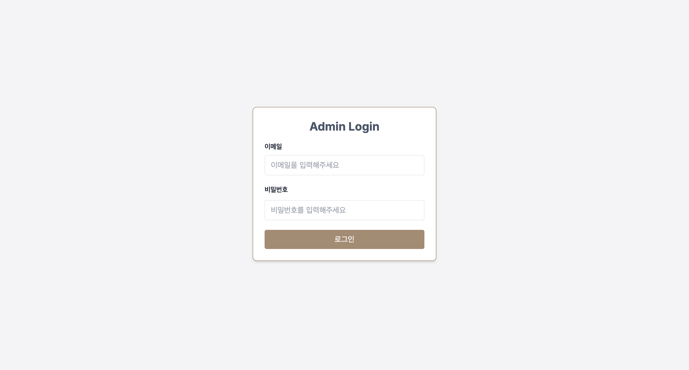
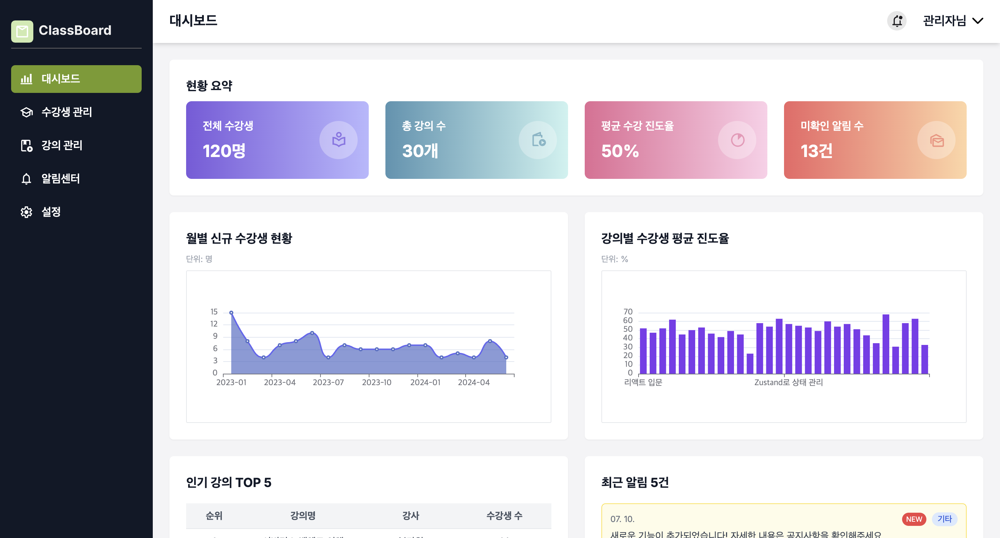
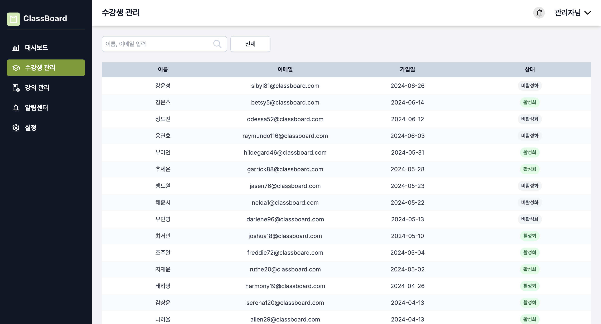
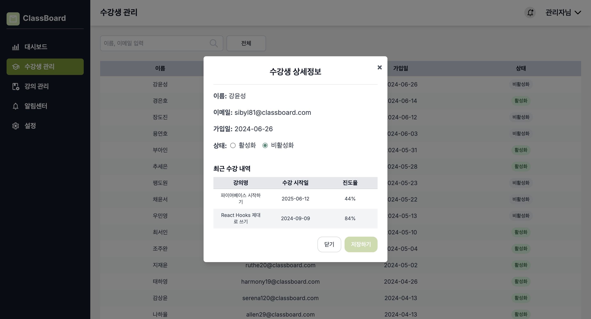
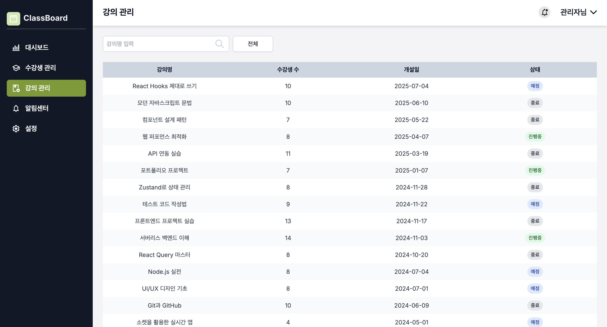
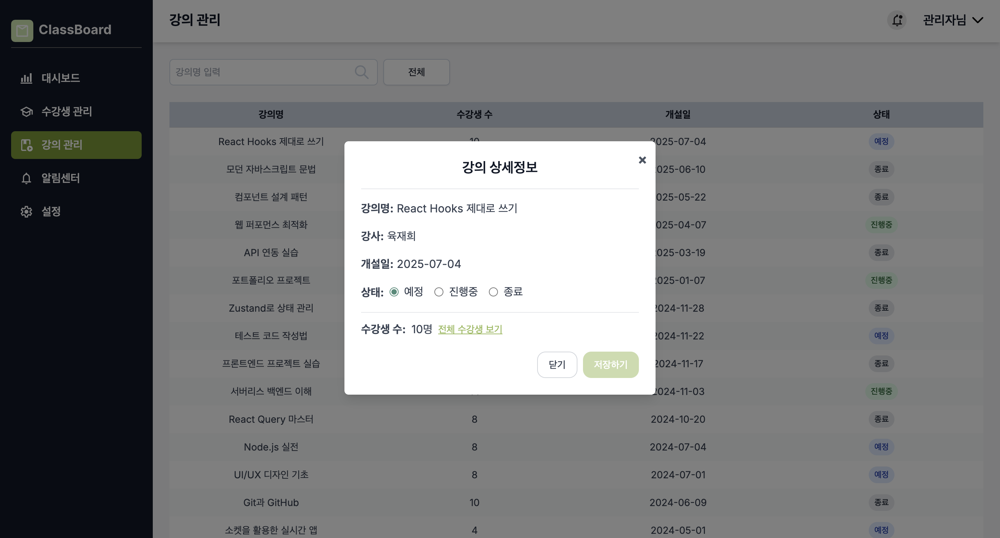
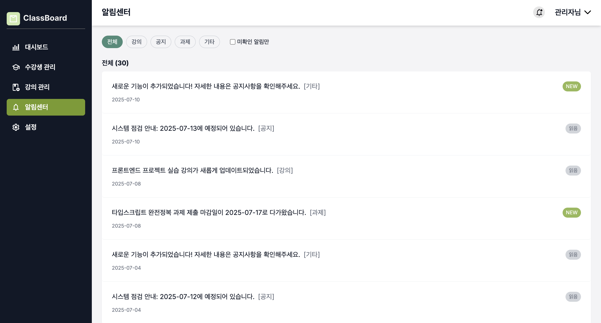

# Class Board Admin

### 🌐 배포 URL

[admin 바로가기](https://classboard.shop/)

---

### ⚙️ 관리자 계정

- **ID**: admin
- **PW**: admin123!

---

## 🎓 프로젝트 소개

Class Board Admin은 가상의 교육 플랫폼을 위한 관리자 웹 애플리케이션입니다.  
수강생 관리, 강의 현황 조회, 알림 확인 등 주요 운영 기능을 포함하고 있습니다.  
프론트엔드와 백엔드를 직접 개발했으며, AWS EC2에 배포까지 완료한 풀스택 프로젝트입니다.

## 📌 주요 기능

- **로그인/로그아웃**  
  JWT 기반 인증으로 안전한 접근 관리

  

- **대시보드**

  - 운영 현황 요약 정보 제공
  - 월별 신규 가입자 수 차트
  - 강의별 출석률 차트
  - 인기 강의 및 최신 알림 확인

  

- **수강생 관리**

  - 수강생 목록 조회 및 검색
  - 상세정보 모달 보기
  - 수강생 계정 상태 변경 기능

  
  

- **강의 관리**

  - 강의 목록 조회 및 검색
  - 상세정보 모달 보기
  - 강의 상태 변경 기능

  
  

- **알림센터**

  - 카테고리별 알림 목록 조회
  - 알림 확인 및 상태 관리

  

## 🛠️ 기술 스택

### 프론트엔드

- **Framework**: Next.js, React
- **언어**: TypeScript
- **스타일링**: Tailwind CSS
- **상태 관리**: Zustand
- **API 통신**: Axios
- **데이터 시각화**: Echarts
- **테스트**: React Testing Library, Jest

### 백엔드

- **런타임**: Node.js
- **프레임워크**: Express
- **ORM**: Prisma
- **DB**: SQLite
- **인증**: JWT 기반 인증 (Access Token / Refresh Token)
- **보안**: 비밀번호 해시화 (bcrypt), HttpOnly 쿠키 사용
- **테스트**: Jest, Supertest

### 배포환경

- **프론트엔드**: AWS EC2 (Ubuntu) + PM2 + Nginx
- **백엔드**: AWS EC2 (Ubuntu) + PM2 + Nginx
- **도메인 관리**: AWS Route 53
- **HTTPS 인증서**: Let's Encrypt (Certbot)
